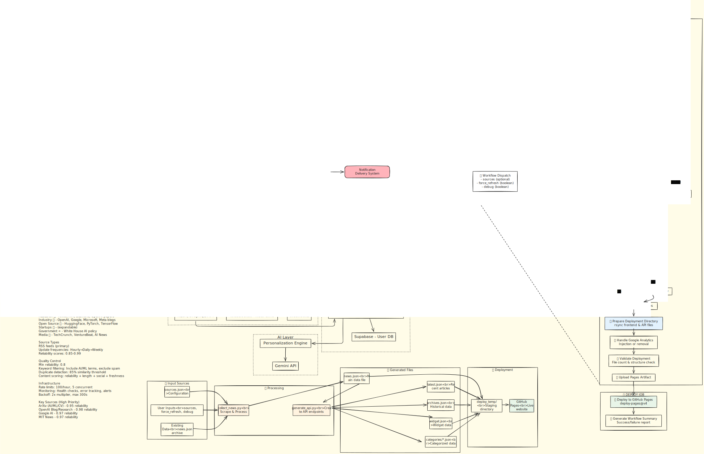

# NewsXP AI

AI-curated daily news aggregation platform featuring the latest developments in technology, research, and industry insights.

## Project Structure

```
src/
├── frontend/           # Web application
│   ├── components/     # JavaScript modules and components
│   ├── utils/         # Utility functions and helpers
│   ├── styles/        # CSS stylesheets
│   └── assets/        # Images and static assets
├── backend/           # Data collection and processing
│   ├── collectors/    # News collection scripts
│   ├── processors/    # Data processing modules
│   ├── api/          # API generation and endpoints
│   └── data/         # Generated news data
├── shared/            # Shared resources
│   ├── types/        # TypeScript type definitions
│   └── config/       # Configuration files
└── services/          # External services
    └── mcp-server/   # Model Context Protocol server
```

## Architecture

The system follows a three-stage pipeline for processing news:



1. **Internet** - Source of news content
2. **Data Collection** - RSS feeds and API content extraction
3. **AI Processing** - LLM-powered filtering, categorization, and summarization

## Getting Started

### Prerequisites
- Python 3.8 or higher
- Node.js 16.0 or higher
- Git

### Installation

1. Clone the repository:
```bash
git clone https://github.com/SiddanthEmani/newsxp-ai.git
cd newsxp-ai
```

2. Install dependencies:
```bash
# Install Node.js dependencies
npm install

# Install Python dependencies
npm run install-backend

# Install MCP server dependencies
npm run install-mcp
```

### Running the Application

1. **Development Mode**: Start the web server
```bash
npm run dev
```

2. **Collect News**: Run news collection
```bash
npm run collect
```

3. **Generate API**: Create API files
```bash
npm run generate-api
```

4. **Full Build**: Collect news and generate API
```bash
npm run build
```

5. **Complete Start**: Build and serve
```bash
npm start
```

### Available Scripts

- `npm run dev` - Start development server
- `npm run collect` - Collect latest news
- `npm run generate-api` - Generate API files
- `npm run build` - Full build process
- `npm start` - Build and serve application
- `npm run mcp-server` - Start MCP server

## Features

- **AI-Curated Content**: Automated news collection and filtering
- **Multiple Categories**: Research papers, industry news, open-source updates
- **Real-time Updates**: Fresh content collection on schedule
- **Newspaper Layout**: Classic newspaper-style design
- **Mobile Responsive**: Optimized for all devices
- **Performance Optimized**: Caching and lazy loading

## Configuration

News sources and collection settings can be configured in `src/shared/config/sources.json`.

## Contributing

1. Fork the repository
2. Create a feature branch
3. Make your changes
4. Test thoroughly
5. Submit a pull request

## License

MIT License - see LICENSE file for details.
