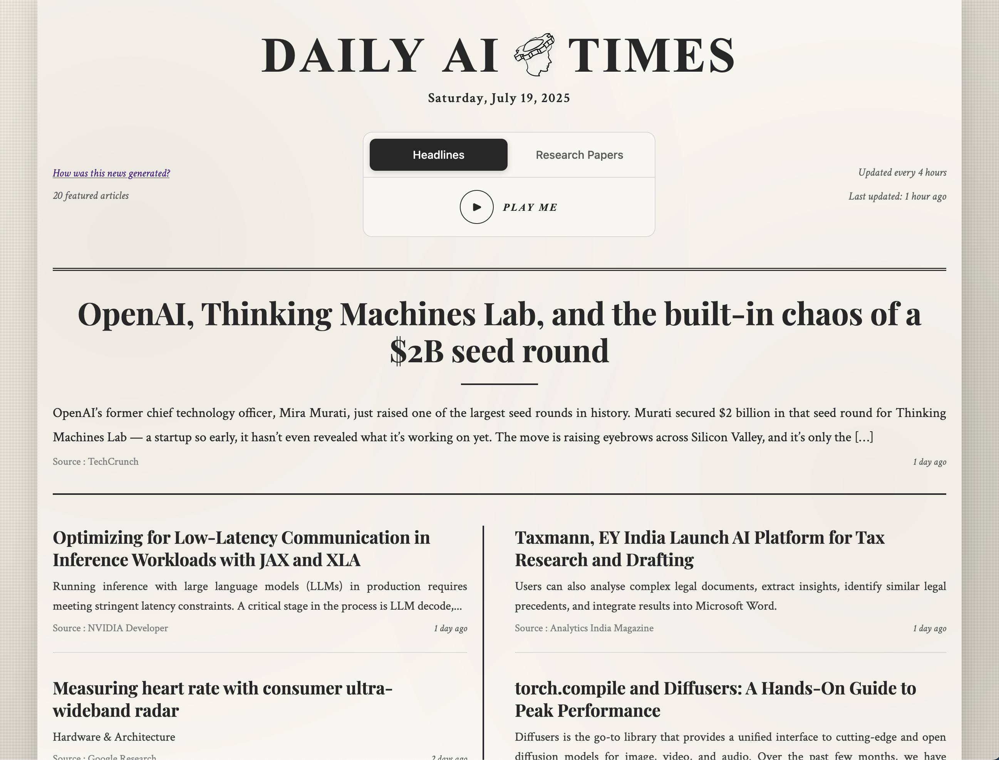
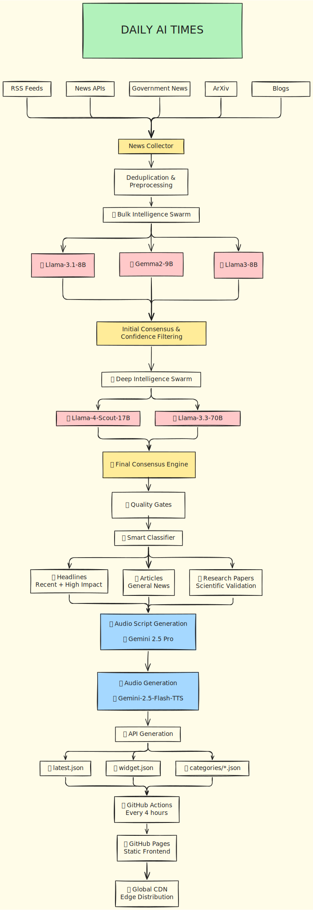

# Daily AI Times

Modern serverless AI-powered news aggregation platform with advanced multi-agent swarm intelligence and consensus-driven content curation.

## Live Demo

**Production Site**: [https://siddanthemani.github.io/daily-ai-times](https://siddanthemani.github.io/daily-ai-times)



## Architecture



**Serverless Backend (GitHub Actions)** → **Static Frontend (GitHub Pages)**

```
┌─────────────────┐    ┌──────────────────┐    ┌─────────────────┐
│   Data Sources  │    │  GitHub Actions  │    │  GitHub Pages   │
│                 │    │  (Serverless     │    │  (Static        │
│ • RSS Feeds     │───▶│   Backend)       │───▶│   Frontend)     │
│ • News APIs     │    │                  │    │                 │
│ • Research APIs │    │ • Data Collection│    │ • Static Site   │
└─────────────────┘    │ • AI Processing  │    │ • JSON APIs     │
                       │ • API Generation │    │ • Asset Serving │
                       └──────────────────┘    └─────────────────┘
```

### Backend Pipeline (Every 4 Hours)
1. **Collection** - Intelligent gathering from 30+ configured news sources
2. **Bulk Intelligence Swarm** - Multi-agent parallel processing with specialized AI models
3. **Initial Consensus** - Advanced consensus algorithms for content filtering
4. **Deep Intelligence Analysis** - Sophisticated fact-checking, bias detection, and impact analysis
5. **Final Consensus** - Weighted combination of initial and deep intelligence results
6. **Content Classification** - Automatic categorization into headlines, articles, and research papers
7. **API Generation** - Dynamic creation of optimized JSON endpoints
8. **Deployment** - Seamless push to GitHub Pages with validation

### Frontend Features
- **Responsive Design** - Newspaper-style layout optimized for all devices
- **Real-time Loading** - Dynamic content updates from JSON APIs
- **Offline Support** - Service worker caching for offline access
- **Performance Optimized** - Minimal JavaScript, fast loading

### Benefits
- **Zero hosting costs** - GitHub Pages + Actions free tier
- **Global CDN** - Automatic scaling and edge distribution
- **Secure & reliable** - GitHub's enterprise infrastructure
- **Fast deployment** - Changes live in minutes
- **Built-in monitoring** - Workflow status and analytics

## Quick Start

### For Users
Visit the live site - no installation required.

### For Developers

```bash
git clone https://github.com/SiddanthEmani/daily-ai-times.git
cd daily-ai-times

# Install Python dependencies
pip install -r src/backend/requirements.txt

# Test the complete pipeline locally
./orchestrator.run

# Or run with Python directly
python src/backend/orchestrator.py
```

### For Contributors
1. **Fork the repository**
2. **Configure GitHub Secrets**:
   - `GROQ_API_KEY` - Required for AI processing
   - `GOOGLE_ANALYTICS_ID` - Optional analytics
3. **Enable GitHub Pages** with "GitHub Actions" source
4. **Test locally** before pushing changes
5. **Push changes** - Automatic deployment via workflow

## Features

### 🤖 Advanced AI Processing
- **Multi-Agent Swarm Intelligence** - Distributed processing with specialized AI models
- **Consensus Algorithms** - Advanced voting and confidence-based filtering
- **Deep Intelligence Analysis** - Fact-checking, bias detection, and credibility scoring
- **Adaptive Batch Processing** - Dynamic optimization for model rate limits

### 📰 Content Management
- **Smart Classification** - Automatic sorting into headlines, articles, and research papers
- **Multi-Source Integration** - Research papers, industry news, open-source updates
- **Advanced Deduplication** - Intelligent content cleanup and similarity detection
- **Quality Gates** - Multi-tier confidence scoring and validation

### ⚡ Performance & Reliability
- **Fresh Content** - Updates every 4 hours with modern orchestrator
- **Robust Error Handling** - Built-in timeouts, retries, and graceful degradation
- **Performance Monitoring** - Detailed pipeline metrics and usage tracking
- **Serverless Architecture** - Zero infrastructure management with GitHub Actions

## Development Commands

| Command | Description |
|---------|-------------|
| `./orchestrator.run` | Run complete AI processing pipeline locally |
| `python src/backend/orchestrator.py` | Run orchestrator directly with Python |
| `npm run mcp-server` | Start MCP server for development tools |
| Manual triggers via GitHub Actions | Test pipeline with custom parameters |

## Pipeline Configuration

The modern AI pipeline is configured via YAML files in `src/shared/config/`:

**Sources**: `sources/*.yaml` - Individual source configurations for each category  
**Application**: `app.yaml` - General pipeline parameters and collection limits  
**AI Swarm**: `swarm.yaml` - Multi-agent configuration, consensus rules, and model settings

### AI Swarm Configuration
- **Bulk Intelligence Agents** - Multiple specialized models for parallel processing
- **Deep Intelligence Agents** - Advanced analysis models with enhanced capabilities
- **Consensus Engine** - Voting algorithms and confidence thresholds
- **Final Consensus** - Weighted combination rules and quality gates
- **Rate Limiting** - Intelligent model-specific TPM management and batching

## Workflow Automation

The GitHub Actions workflow (`collect-news.yml`) runs every 4 hours with modern serverless architecture:

### Automated Processing
1. **AI News Processing Pipeline** - Single orchestrator handles complete workflow
2. **Multi-Agent Swarm Intelligence** - Distributed AI processing with consensus algorithms  
3. **Automatic API Generation** - Dynamic creation of frontend-ready JSON endpoints
4. **GitHub Pages Deployment** - Seamless content delivery with validation
5. **Pipeline Monitoring** - Detailed metrics, usage tracking, and performance analytics

### Manual Triggers
Available via GitHub Actions interface with advanced options:
- **Source Selection** - Choose specific sources or process all
- **Force Refresh** - Override caching and force complete refresh
- **Debug Mode** - Enable detailed deployment structure logging
- **Skip Deployment** - Run processing without deploying (useful for testing)
- **Pipeline Metrics** - Real-time processing statistics and agent performance

## Legal Compliance & Fair Use

### What This Service Does
Daily AI Times is an AI-powered news discovery and recommendation platform that:
- **Curates** the top 25 articles from public RSS feeds across 4 categories
- **Preserves** all original titles, descriptions, and attributions without modification
- **Links** directly to original publisher websites
- **Operates** like an intelligent RSS reader with AI-powered ranking

### Legal Basis for Operation
This service operates under established legal principles that protect:

1. **Search Engines & News Aggregators** - Similar to Google News, we help users discover content without reproducing it
2. **Fair Use for Indexing** - Processing publicly available RSS metadata for ranking and recommendation
3. **Transformative Purpose** - Adding value through AI analysis and curation without replacing original content
4. **No Market Harm** - Driving traffic TO publishers, not away from them

### What We Process
- **RSS Feed Metadata**: Titles, descriptions, and links that publishers make publicly available
- **No Full Articles**: We never store or display full article content
- **No Paywalled Content**: Only publicly accessible RSS feeds
- **Attribution Preserved**: All sources clearly credited with direct links

### Industry Precedents
This service operates similarly to established platforms:
- Search engines (indexing and ranking content)
- Social media platforms (showing link previews)
- RSS readers (displaying feed content)
- News aggregators (Techmeme, Google News, Apple News)

### Publisher Benefits
- **Increased Traffic**: Direct links drive readers to publisher sites
- **Broader Reach**: AI curation helps quality content find its audience
- **Preserved Attribution**: Full credit and linking maintained
- **No Content Theft**: Readers must visit publisher sites for full articles

### DMCA Compliance & Opt-Out
While we believe our service operates within fair use principles:
- Publishers may request removal via Discussions
- We respect robots.txt and RSS usage guidelines
- DMCA notices will be promptly addressed

### User Responsibilities
If you deploy your own instance:
- Respect publisher terms of service
- Maintain attribution and links
- Consider local copyright laws
- Use responsible crawling practices

### Disclaimer
This service provides AI-powered recommendations based on publicly available RSS feeds. All content remains the property of original publishers. The AI analysis and rankings are provided for informational purposes only.

### Ethical AI Commitment
- **Transparency**: Our curation process is documented and open source
- **No Manipulation**: Rankings based on quality signals, not political or commercial bias
- **Publisher Friendly**: Designed to support, not replace, original journalism

## License

MIT License
