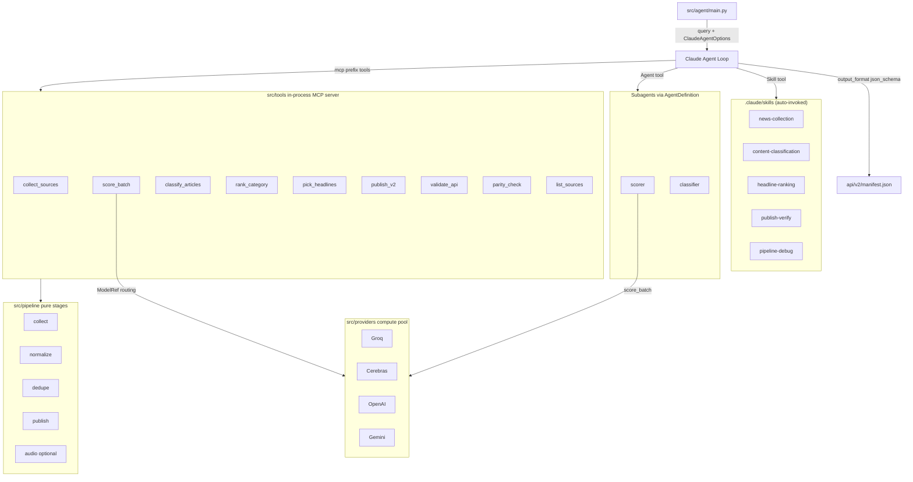

# Daily AI Times v2 Architecture

## One-picture view

See `docs/architecture-preview.html` for the rendered Mermaid diagram.

## Responsibilities

| Layer | Module | Responsibility |
|---|---|---|
| Orchestrator | `src/agent/main.py` | Drives Claude Agent SDK `query()`; picks between fixture mode and live mode |
| Options | `src/agent/options.py` | Assembles `ClaudeAgentOptions` (tools, skills, subagents, hooks, model) |
| Hooks | `src/agent/hooks.py` | Pre/post tool traffic logging; gates destructive tools |
| Subagents | `src/agent/subagents.py` | `scorer`, `classifier` — isolated contexts for heavy sub-tasks |
| MCP server | `src/tools/server.py` | `create_sdk_mcp_server(name='daily_ai', version='1.0.0')` |
| Tools | `src/tools/{collection,scoring,ranking,publishing}.py` | Ten `@tool` handlers, all read/write `PipelineState` |
| State | `src/tools/state.py` | Per-session `PipelineState` singleton to avoid context bloat |
| Providers | `src/providers/{registry,groq,cerebras,openai,gemini}.py` | Provider-neutral compute; TPM buckets; tier routing |
| Pipeline | `src/pipeline/{collect,normalize,dedupe,publish,audio}.py` | Pure async stages; Pydantic boundaries; no LLM calls |
| Skills | `.claude/skills/*/SKILL.md` | Model-invoked capabilities; loaded via `setting_sources=['project']` |
| Config | `src/config/{app,providers,swarm}.yaml` + `sources/*.yaml` | Single source of truth for tunables |

## Invariants

- Pipeline stages never call LLMs directly. LLM access is mediated by
  `src/providers/registry.py` (for bulk work) or the Claude Agent SDK `query()`
  loop (for reasoning).
- Every stage boundary is a Pydantic v2 model — invalid data fails loud.
- Tool outputs are MCP content blocks; errors return `is_error: True` so the
  agent loop stays alive and can retry or degrade.
- `src/frontend/api/` (v1) and `src/frontend/api/v2/` (v2) coexist until
  cutover. The frontend resolves between them via `?v2=1`.
- `src/legacy/` is frozen; no new work lands there.
