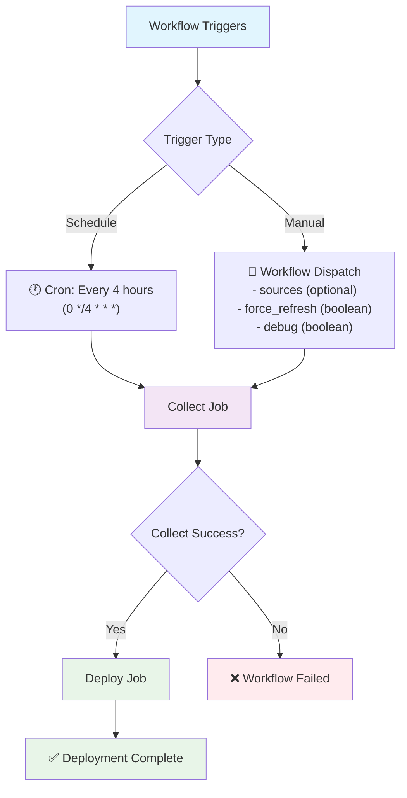
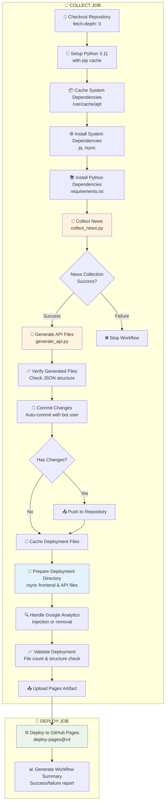
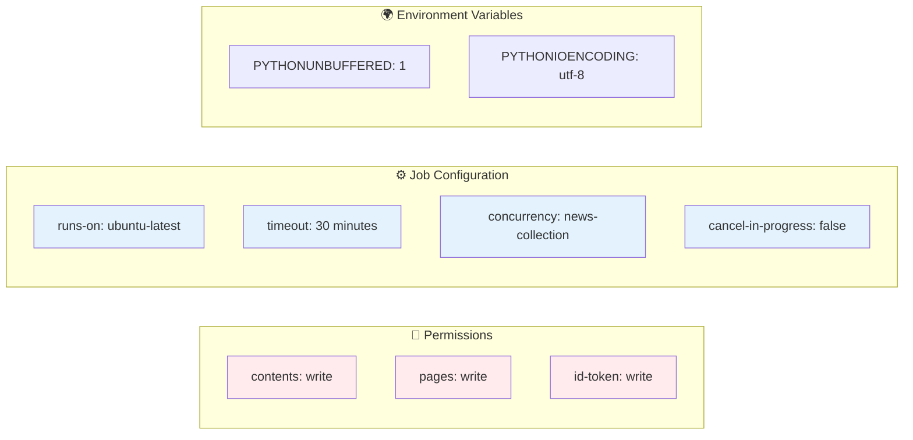
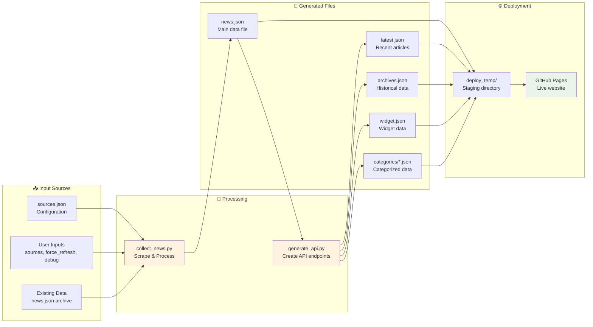
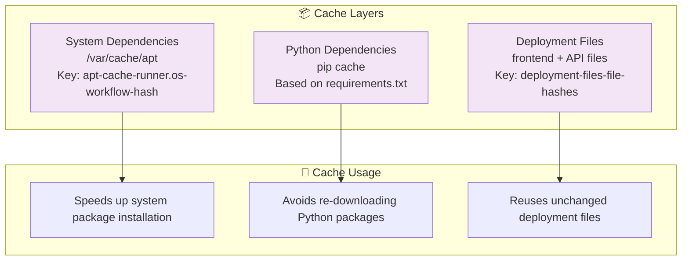
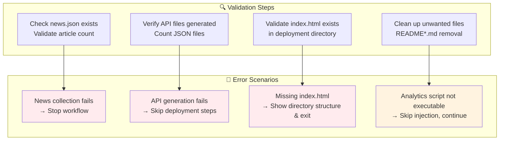

# GitHub Actions Workflow Visualization: collect-news.yml

## Workflow Overview

## Detailed Job Flow

## Configuration & Permissions

## File Flow & Data Pipeline

## Caching Strategy

## Error Handling & Validation

## Workflow Summary Features

- **🕐 Automated Schedule**: Runs every 4 hours automatically
- **🔄 Manual Trigger**: Can be run manually with custom parameters
- **📊 Smart Deployment**: Only deploys when there are actual changes
- **⚡ Performance Optimized**: Uses caching and rsync for efficiency
- **🔍 Debug Mode**: Optional detailed logging for troubleshooting
- **📱 Google Analytics**: Automatic injection or removal based on secrets
- **🤖 Auto-commit**: Commits changes with bot user credentials
- **📈 Workflow Reports**: Generates summary of execution results
